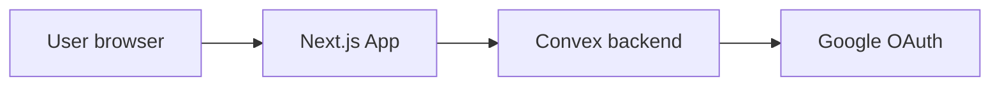

# Muhasabah (Convex + Google-only auth)

## Auth decision (locked)

- Use **[Convex Auth](https://labs.convex.dev/auth)** (`@convex-dev/auth`) with **Google as the only configured provider** — no password, no email magic link, no Apple/GitHub unless you add them later.
- Implementation notes:
  - Register a Google OAuth client (Web) with authorized redirect URIs that match Convex Auth’s callback URLs for your deployment(s) (dev + prod).
  - Store `AUTH_GOOGLE_ID` / `AUTH_GOOGLE_SECRET` (exact env names follow the Convex Auth setup wizard) in the Convex dashboard; wire the React provider + `ConvexAuthProvider` in [`src/app/layout.tsx`](src/app/layout.tsx) or a small `providers.tsx`.
  - UI: a single primary action **“Continue with Google”** on an unauthenticated gate; hide other sign-in options.

## Current codebase baseline

- Next.js 16 + Tailwind template: [`src/app/page.tsx`](src/app/page.tsx), [`src/lib/env.ts`](src/lib/env.ts).
- **Convex:** [`convex/_generated/`](convex/_generated/) exists (codegen run), but **[`convex/schema.ts`](convex/schema.ts) is not present yet** — [`convex/_generated/dataModel.d.ts`](convex/_generated/dataModel.d.ts) falls back to permissive `any` until the schema is added.
- [`package.json`](package.json) still has no `convex` / `@convex-dev/auth` dependencies; those ship with the implementation pass (or when you run your usual install).

## Schema design ([`convex/schema.ts`](convex/schema.ts))

Two tables: **`userSettings`** (one row per user, optional but recommended for consistent `dateKey`) and **`muhasabahEntries`** (one row per user per calendar day).

### Table: `userSettings`

| Field | Convex type | Notes |
|--------|-------------|--------|
| `userId` | `v.string()` | Same identifier you read from auth in functions (e.g. identity `subject` / Convex Auth user id — align with `@convex-dev/auth` docs when wiring). |
| `ianaTimezone` | `v.string()` | e.g. `America/Los_Angeles`; set from `Intl.DateTimeFormat().resolvedOptions().timeZone` on first load or in settings. |
| `updatedAt` | `v.number()` | Last write time (set only in **mutations**, e.g. `Date.now()`). |

**Index:** `by_user` on `["userId"]` — at most one doc per user (enforce in upsert mutation: query by index, patch or insert).

### Table: `muhasabahEntries`

One document per **(userId, dateKey)**. **Numeric ranges** (0–10, 0–20, −20–20, etc.) are **not** expressible in the Convex schema file; enforce them in `upsertDay` (and mirror in Zod on the client).

| Field | Convex type | Score range / meaning |
|--------|-------------|------------------------|
| `userId` | `v.string()` | Owner; must match authenticated user in mutations. |
| `dateKey` | `v.string()` | Calendar day **`YYYY-MM-DD`** in the user’s `ianaTimezone` (computed on client; validate format in mutation with a simple regex). |
| `prayers` | `v.object({ ... })` | Five keys, each `v.union(v.literal(0), v.literal(1), v.literal(2))`: **`fajr`**, **`dhuhr`**, **`asr`**, **`maghrib`**, **`isha`**. Sum = prayer subtotal **0–10** (computed in query or shared TS helper, not duplicated in DB unless you want a denormalized `prayerTotal`). |
| `dhikrQuran` | `v.number()` | 0–10 |
| `ibadat` | `v.number()` | 0–10 |
| `kindness` | `v.number()` | 0–20 |
| `learning` | `v.number()` | 0–10 |
| `tongueDistractions` | `v.number()` | −20–20 |
| `heart` | `v.number()` | 0–20 |
| `notes` | `v.optional(v.object({ ... }))` | Optional short reflection strings **per scored block** (omit prayers if scores suffice): e.g. `dhikrQuran`, `ibadat`, `kindness`, `learning`, `tongue`, `heart` — all `v.optional(v.string())`. Truncate or cap length in mutation if you want (e.g. 5000 chars). |
| `updatedAt` | `v.number()` | Last save (mutations only). |

**Index:** `by_user_and_date` on `["userId", "dateKey"]` — used for `getDay` and upsert lookup.

### Authoritative `defineSchema` shape (implement in [`convex/schema.ts`](convex/schema.ts))

Reuse a small helper for the three prayer score literals to avoid repetition:

```ts
import { defineSchema, defineTable } from "convex/server";
import { v } from "convex/values";

const score012 = v.union(v.literal(0), v.literal(1), v.literal(2));

export default defineSchema({
  userSettings: defineTable({
    userId: v.string(),
    ianaTimezone: v.string(),
    updatedAt: v.number(),
  }).index("by_user", ["userId"]),

  muhasabahEntries: defineTable({
    userId: v.string(),
    dateKey: v.string(),
    prayers: v.object({
      fajr: score012,
      dhuhr: score012,
      asr: score012,
      maghrib: score012,
      isha: score012,
    }),
    dhikrQuran: v.number(),
    ibadat: v.number(),
    kindness: v.number(),
    learning: v.number(),
    tongueDistractions: v.number(),
    heart: v.number(),
    notes: v.optional(
      v.object({
        dhikrQuran: v.optional(v.string()),
        ibadat: v.optional(v.string()),
        kindness: v.optional(v.string()),
        learning: v.optional(v.string()),
        tongue: v.optional(v.string()),
        heart: v.optional(v.string()),
      }),
    ),
    updatedAt: v.number(),
  }).index("by_user_and_date", ["userId", "dateKey"]),
});
```

When you add **`@convex-dev/auth`**, follow its docs to merge any **auth-related tables** (sessions, accounts, etc.) into the same `defineSchema` export so nothing collides with `userSettings` / `muhasabahEntries`.

After adding this file, run **`npx convex dev`** (or your project’s Convex dev command) so [`convex/_generated/dataModel.d.ts`](convex/_generated/dataModel.d.ts) picks up strict `Doc` types.

### Totals

- **Daily total** (computed, not stored unless you add a redundant field for analytics):  
  `sum(prayers) + dhikrQuran + ibadat + kindness + learning + tongueDistractions + heart`  
  where `sum(prayers)` is the sum of the five `0|1|2` slots. Invariant: **−20 ≤ total ≤ 100** if per-field bounds are enforced.

**Mutation validation:** Reject out-of-range numbers; reject malformed `dateKey`; ensure `ctx.auth` identity matches `userId` on write.

**Queries:** Pass **`dateKey` as an argument** from the client — do **not** use `Date.now()` inside queries to infer “today” ([Convex caching / reactivity](https://docs.convex.dev/database/advanced/occ)).

**“Which day is today?”** Client computes today’s `dateKey` using `userSettings.ianaTimezone` (or browser TZ until settings exist), then calls `getDay` / `upsertDay` with that string.

## Convex functions

- **`getDay` query:** args: `dateKey`; resolve `userId` from auth → `muhasabahEntries` row or `null` via `by_user_and_date`.
- **`listRecent` query:** optional — last N entries for the signed-in user (order by `dateKey` desc with a reasonable cap, or paginate later).
- **`upsertDay` mutation:** validate prayer literals (schema-enforced) and numeric ranges; enforce identity matches `userId`; upsert on `by_user_and_date`.
- **`upsertUserSettings` mutation:** set `ianaTimezone` / `updatedAt` for the signed-in user.
- **Computed total:** sum of five prayer slots + `dhikrQuran + ibadat + kindness + learning + tongueDistractions + heart` — if all per-field bounds hold, total stays in `[−20, 100]` (optional assert in mutation for defense in depth).

## Frontend (App Router)

- **Product name:** **Muhasabah** (page title, nav, metadata, and user-facing copy).
- **Route:** e.g. [`src/app/(app)/muhasabah/page.tsx`](src/app/(app)/muhasabah/page.tsx) (protected).
- **ConvexReactClient** + auth provider wrapper in layout.
- **UI structure:** one page with sections 1–7 matching your copy; each section shows rubric bullets (static) + inputs:
  - Prayers: five discrete controls (0 / 1 / 2) with labels “on time + presence”, etc.
  - Other sections: sliders or number inputs with min/max per section.
- **Sticky summary:** running total and per-section subtotals; optional “Save” with optimistic UX via `useMutation`.
- **Accessibility:** labeled inputs, keyboard-friendly controls, sufficient contrast (reuse existing Tailwind patterns from [`src/app/globals.css`](src/app/globals.css)).

## Environment and ops

- Extend [`src/lib/env.ts`](src/lib/env.ts) with `NEXT_PUBLIC_CONVEX_URL` (and any Next-only Convex Auth env vars the setup requires).
- Document in README: `npx convex dev` for backend (per your workflow, **you** run install/convex commands when you use `/build` or locally — the plan does not assume the agent runs `npm`/`npx` unless you lift that rule for implementation).

## Testing (light)

- Vitest unit tests for **pure helpers**: e.g. `computeTotal`, `prayerSum`, bounds checking — keeps logic testable without hitting Convex.



## Out of scope (unless you add later)

- Admin analytics, multi-user dashboards, export PDF, Arabic UI/RTL — can layer on after the core loop works.
